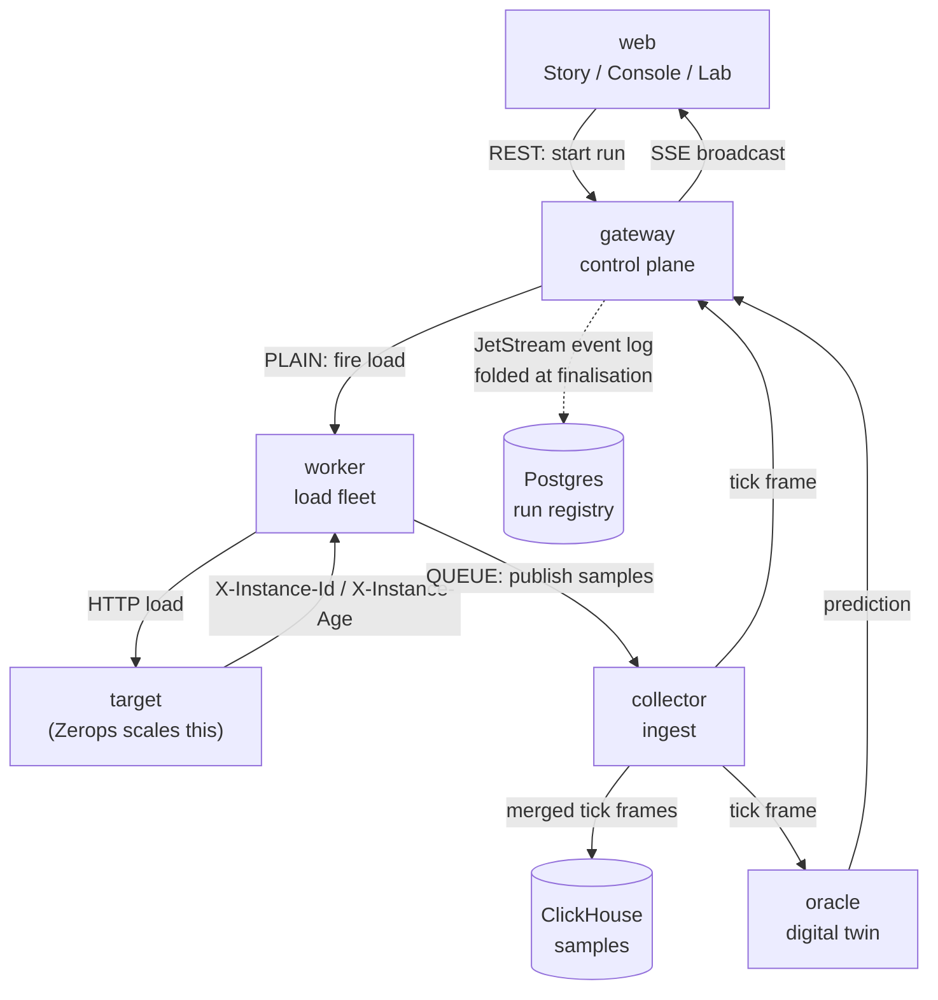

# Architecture

## Services

Twelve services. Every one is load-bearing — none is here to pad the count.

| Service     | Type       | Role                                                                      |
| ----------- | ---------- | ------------------------------------------------------------------------- |
| `web`       | static     | Story (landing), live Console, and the Lab (envelope/compare)             |
| `gateway`   | nodejs     | Control plane — admission, the two-phase start barrier, SSE fan-out, REST |
| `collector` | nodejs     | Ingest — merges fleet samples into tick frames, writes ClickHouse         |
| `worker`    | nodejs     | Load fleet — fires the profile, or runs the latency-target autopilot      |
| `target`    | nodejs     | The service under test — this is what Zerops scales                       |
| `oracle`    | nodejs     | Autoscaler digital twin — predicts the container count ~15s ahead         |
| `chaos`     | nodejs     | Fault injector — kill / degrade / partition the target on command         |
| `scheduler` | nodejs     | Runs unattended experiment suites through the gateway's own API           |
| `nats`      | broker     | Commands fan out, telemetry fans in, the run log streams (JetStream)      |
| `db`        | postgresql | Write model — run registry, suites, twin parameters                       |
| `metrics`   | clickhouse | Read model — every observed sample, queried by aggregate                  |
| `cache`     | valkey     | Live materialized view — rolling container window, locks, credit budget   |



Every run is an append-only event log on JetStream — `created`, `armed`,
`started`, one `tick` per second, `scaled`, `slo`, `chaos`, `prediction`,
`completed`. Postgres, ClickHouse, and Valkey are each a purpose-built
projection of that log, not three independent sources of truth (see
`packages/contracts/src/events.js`). Replay re-emits the same log at its
original pace into the same SSE pipe live traffic uses — the frontend has no
code path that knows whether it's watching now or three hours ago.

## Repo layout

```
apps/
  gateway/    control plane: orchestrator, replay engine, REST, SSE, topology
  collector/  ingest: bucket watermarking, container window, SLO/scale detection
  worker/     load fleet: LoadFleet engine (fleet.js) + NATS wiring (index.js)
  target/     the service under test
  oracle/     autoscaler digital twin (online parameter estimation, not ML)
  chaos/      fault injector
  scheduler/  unattended experiment suites (knee search, envelope sweep, regression)
  web/        React + Vite dashboard — Story, Console, Lab
packages/
  contracts/  subjects, event catalog, TickFrame shape, load profiles — the
              single source of truth every service imports rather than
              hand-typing a subject string or event shape
  bus/        NATS connect/subscribe/publish/broadcast helpers, JetStream bootstrap
  stores/     Postgres, ClickHouse (HTTP), Valkey clients + the invariants
              that live in each (run lock, credit budget, rolling window)
  control/    LatencyAutopilot (PID), AutoscalerTwin, capacity-envelope solver,
              the autoscaler report card (scorecard.js)
  telemetry/  logging, the shared bucket clock, LatencyHistogram, InstanceWindow
infra/
  migrations/postgres/    write-model schema
  migrations/clickhouse/  read-model schema + the views the API queries
zerops.yaml                 one file, one setup per service (npm workspaces monorepo)
zerops-project-import.yaml  the whole project, one file
```

## Watch it happen: the live topology panel

The console's `Architecture, live` panel (`apps/web/src/components/TopologyPanel.jsx`)
draws the real service graph — the same `SUBJECT_TABLE` and health checks
already served by `GET /api/topology` — and animates a packet along an edge
every time an SSE event proves that hop just happened: a `tick` lights up
`collector→gateway`, an oracle `finding` lights up `oracle→gateway`, a chaos
command and its effect report light up opposite directions on the same edge.
It's inference, not a literal network trace (every SSE event physically
arrives over the one gateway→browser hop), and the panel says so. Animation
runs DOM-direct via a new `sendPacket` helper and a side-channel pub/sub
(`onTopologyEvent` / `emitTopologyEvent`) in `apps/web/src/motion/gsap.js`,
bypassing the Zustand store entirely so a hot SSE burst doesn't force a
re-render on every other console panel.

## The two technical tricks that make it work

**Force horizontal scaling, not vertical.** Zerops scales vertically first —
more CPU inside the container — and only adds containers once that ceiling is
hit. `target`'s vertical ceiling is capped low and set to **dedicated** CPU
mode (Zerops' own docs: the horizontal-trigger CPU thresholds apply to
dedicated CPU only), and the `/work` endpoint burns real CPU via
`crypto.pbkdf2Sync`, tunable by a `rounds` parameter.

**Count containers without a privileged API.** Every `target` container mints
a UUID at boot and returns it in `X-Instance-Id`. Distinct IDs in a rolling
ten-second window is the live container count — measured, not self-reported,
and it needs no platform token. `X-Instance-Age` additionally lets the system
reconstruct a full container lifecycle swimlane from HTTP headers alone.

## What's genuinely still in progress

- The story page is a hero + live attract-mode replay, not yet the full
  scroll-scrubbed narrative (Lenis + ScrollTrigger scrubbing a recorded run as
  you scroll a pinned section). The scaffolding for it is registered and ready
  in `apps/web/src/motion/gsap.js`.
- The Lab view's suite runner works (`scheduler` executes knee/envelope/manual/
  regression suites through the gateway's own API) but its live progress isn't
  yet wired to a progress bar in the UI — check `GET /api/runs` meanwhile.
- ClickHouse-backed reads (`timeline`, `instances`, `compare`, degraded replay)
  are code-reviewed and syntax-checked but not yet run against a live
  ClickHouse — see [`testing.md`](./testing.md) for exactly what has and
  hasn't been verified.

None of the above blocks a live demo of the core claim: start a run, watch the
container count climb and fall, replay it afterwards.
